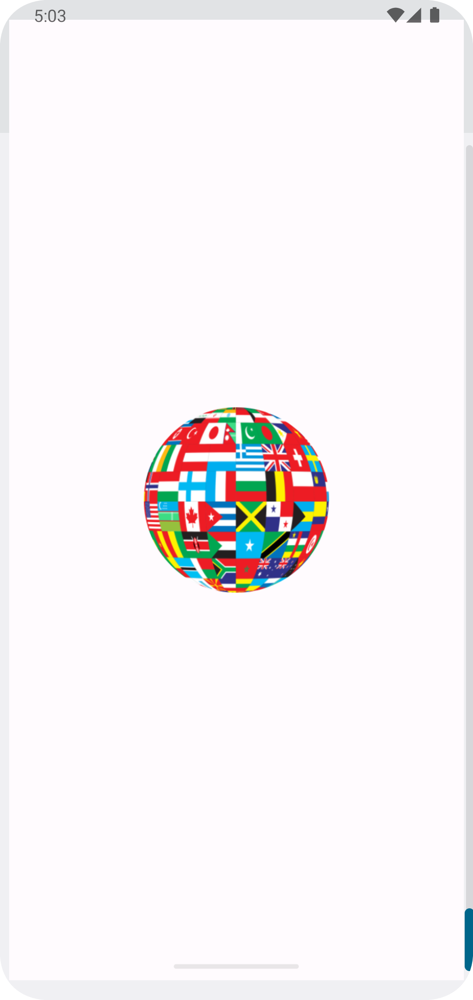
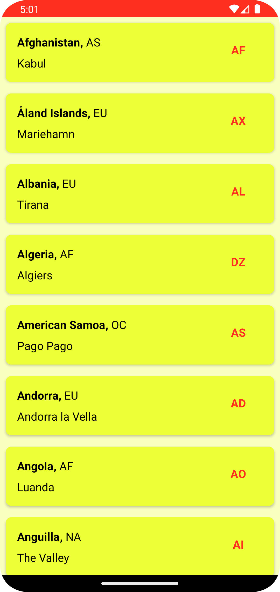

# List Of Countries

List of countries is an Countries list Api.

I have used MVC architecture .
I used Error Hadling and Retrofit to fetch the Api data.
I used XML for UI Design.

This Api as:

* Countries names
* Region
* Countries Code

  
  

List of countries application is still under development in testing

Copyright 2023 Praveen Krishnamoorthy

